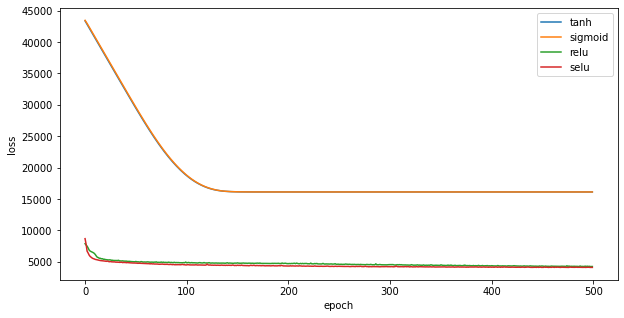

## Introduction
The housing prices in Beijing has always been a hot topic as its complex intrinsic properties. Hence, to have a more clear view of the estate market trends in Beijing, the team applies Neural Networks, General Additive Models and RandomForest to reveal some critical elements that affect the housing prices in Beijing and give reliable predictions. As a result, the team finds that the price is highly related to geographical positions and tradetimes, and the prediction errors of Neural Networks can be reduced to around 4000 yuan. More detailed analysis of all three models will be given in corresponding sections. 

Note:The prediction errors are measured in RMSE. The team uses  R code to build General Additive Models and RandomForest, and Python to build Neural Networks.

## Dataset Info

We chose the 'Housing price in Beijing' dataset from Kaggle. This dataset was based on the real estate trading information available on [Lianjia](https://bj.lianjia.com/chengjiao), which is a popular Chinese real-estate brokerage company. According to the dataset author, most data fetched is from the period of 2011-2018 with some outliers. Therefore this data set is pretty recent and it can provide some Insights on the current housing market. Once we decide to use this dataset, it is uploaded to Github for future convenience as we will perform data cleaning later.

## Data Cleaning  

### Data Structure Summary
First, load the data as Pandas DataFrame and take a look at the data summary.

From `data.info()`, there are 26 columns and 318851 instances in the dataset, but not all features are non-null. For example, almost half of the `DOM` features are null and a number of `livingRoom` and `buildingType` are null. Additionally, although all features are supposed to be encoded in numerical form, some of them have data type `object`. This implies some instances are not numbers and should be handled later. 

```console
<class 'pandas.core.frame.DataFrame'>
RangeIndex: 318851 entries, 0 to 318850
Data columns (total 26 columns):
 #   Column               Non-Null Count   Dtype  
---  ------               --------------   -----  
 0   url                  318851 non-null  object 
 1   id                   318851 non-null  object 
 2   Lng                  318851 non-null  float64
 3   Lat                  318851 non-null  float64
 4   Cid                  318851 non-null  float64
 5   tradeTime            318851 non-null  int64  
 6   DOM                  160874 non-null  float64
 7   followers            318851 non-null  int64  
 8   totalPrice           318851 non-null  float64
 9   price                318851 non-null  int64  
 10  square               318851 non-null  float64
 11  bedRoom              318851 non-null  object 
 12  livingRoom           318851 non-null  object 
 13  kitchen              318851 non-null  int64  
 14  bathRoom             318851 non-null  int64  
 15  floor                318819 non-null  float64
 16  buildingType         318851 non-null  int64  
 17  constructionTime     318851 non-null  int64  
 18  renovationCondition  318851 non-null  int64  
 19  buildingStructure    318851 non-null  int64  
 20  ladderRatio          318851 non-null  float64
 21  elevator             318819 non-null  float64
 22  fiveYearsProperty    318819 non-null  float64
 23  subway               318819 non-null  float64
 24  district             318851 non-null  int64  
 25  communityAverage     318388 non-null  float64
dtypes: float64(12), int64(10), object(4)
memory usage: 63.2+ MB
```
More anomalies about this dataset can be seen from `data.describe()`: 
- The minimum value of `price` in this set is 1
- The maximum value of `bathRoom` is 2011
- The categorical feature `buildingType`, which is supposed to be type integer, contains floating number. 

```console
       |Lng                |Lat                |Cid               |tradeTime        |DOM               |followers         |totalPrice        |price            |square           |kitchen            |bathRoom           |floor             |buildingType      |constructionTime  |renovationCondition|buildingStructure |ladderRatio        |elevator          |fiveYearsProperty  |subway            |district         |communityAverage  |
|------|-------------------|-------------------|------------------|-----------------|------------------|------------------|------------------|-----------------|-----------------|-------------------|-------------------|------------------|------------------|------------------|-------------------|------------------|-------------------|------------------|-------------------|------------------|-----------------|------------------|
|count |318851.0           |318851.0           |318851.0          |318851.0         |160874.0          |318851.0          |318851.0          |318851.0         |318851.0         |318851.0           |318851.0           |318819.0          |318851.0          |318851.0          |318851.0           |318851.0          |318851.0           |318819.0          |318819.0           |318819.0          |318851.0         |318388.0          |
|mean  |116.41845944857548 |39.94959061016476  |1128066400920.8062|1429304082.521303|28.822339221999826|16.731507820267147|349.03020062658396|43530.43637937469|83.24059670504248|0.9945993583209712 |1.1880533540744738 |13.299909980270938|3.0161297910309206|1999.4240287783323|2.6063302294802275 |4.451025714205068 |63.16486041443505  |0.5770546924744134|0.6456014227508399 |0.6011122298231912|6.763563545355041|63682.446304508965|
|std   |0.11205430191102018|0.09198254726123398|2356415925963.8984|51679982.44777191|50.237342565852884|34.20918472341642 |230.78077822518944|21709.02420359375|37.2346608801023 |0.10960891167023223|0.43760482858549293|7.826689186019038 |1.268145133376702 |15.381448827889947|1.3117385168291875 |1.9017534327545682|25068.506083407294 |0.4940276711793244|0.47833141580482863|0.489670367756757 |2.812616086045994|22329.21544718602 |
|min   |116.07251399999998 |39.62703           |1110000000000.0   |1022889600.0     |1.0               |0.0               |0.1               |1.0              |6.9              |0.0                |0.0                |1.0               |1.0               |0.0               |0.0                |0.0               |0.0                |0.0               |0.0                |0.0               |1.0              |10847.0           |
|25%   |116.34498500000001 |39.8932            |1110000000000.0   |1385769600.0     |1.0               |0.0               |205.0             |28050.0          |57.9             |1.0                |1.0                |6.0               |1.0               |1994.0            |1.0                |2.0               |0.25               |0.0               |0.0                |0.0               |6.0              |46339.0           |
|50%   |116.41678          |39.934527          |1110000000000.0   |1442016000.0     |6.0               |5.0               |294.0             |38737.0          |74.26            |1.0                |1.0                |11.0              |4.0               |2002.0            |3.0                |6.0               |0.33299999999999996|1.0               |1.0                |1.0               |7.0              |59015.0           |
|75%   |116.477581         |40.003018          |1110000000000.0   |1469923200.0     |37.0              |18.0              |425.5             |53819.5          |98.71            |1.0                |1.0                |19.0              |4.0               |2005.0            |4.0                |6.0               |0.5                |1.0               |1.0                |1.0               |8.0              |75950.0           |
|max   |116.732378         |40.252758          |1110000000000000.0|1517097600.0     |1677.0            |1143.0            |18130.0           |156250.0         |1745.5           |4.0                |7.0                |63.0              |4.0               |2016.0            |4.0                |6.0               |10009400.0         |1.0               |1.0                |1.0               |13.0             |183109.0          |
```

### Data Dropping

There are a few attributes that we decide to drop from the dataset. First, the batch of the attributes are `url`, `id` and `followers` are dropped, as they are only relevant to the website itself. Next, `total price` and `communityAverage` are dropped, as they are directly calculated from the target attribute `price`. Finally, attribute `DOM` is dropped because filling 160,000 null entries with estimations will certainly affect the prediction accuracy. Data dropping is done by simply not including them in the pipeline.

### Imputation

Mean value and the most frequent category is used respectively to fill missing entries in numerical attributes and categorical attributes.

### Transformation
- All numerical attributes are normalized using StandardScaler from sklearn.
- All non-binary categorical attributes are encoded to one-hot format.
- `tradeTime` attribute is encoded to the unix timestamp form before scaling.
- All the mismatched `bathRoom` and `constructionTime` entries are restored.

All data cleaning processes are done in pipeline:

#### Numerical Data Transformer

class objToNum(BaseEstimator, TransformerMixin):
  def __init__(self):
      return None
  def fit(self, X, y=None):
    return self
  def transform(self, X, y=None):
    for att in object_features:
        X[att] = pd.to_numeric(X[att],errors='coerce')
    return X

num_transformer = Pipeline([
    ('obj', objToNum()),
    ('imputer', SimpleImputer(strategy='mean')),
    ('std_scaler', StandardScaler())])


#### Categorical Data Transformer

def encode_and_bind(original_dataframe, feature_to_encode):
    dummies = pd.get_dummies(original_dataframe[[feature_to_encode]])
    res = pd.concat([original_dataframe, dummies], axis=1)
    return(res)

class oneHot(BaseEstimator, TransformerMixin):
  def __init__(self):
      return None
  def fit(self, X, y=None):
    return self
  def transform(self, X, y=None):
    ref = ['buildingType', 'buildingStructure', 'district', 'Cid']
    X = pd.DataFrame(data=X, columns=cat_features)
    c = X.columns
    for att in c:
      if att in ref:
        X[att] = X[att].astype(str)
        X = encode_and_bind(X, att)
        X = X.drop(att, axis=1)
    return X

cat_transformer = Pipeline([
    ('imputer', SimpleImputer(strategy='most_frequent')),
    ('oneHot', oneHot())])


#### Full Pipeline


full_pipeline = ColumnTransformer(transformers=[
    ('num', num_transformer, num_features),
    ('cat', cat_transformer, cat_features)                        
])

data = full_pipeline.fit_transform(data)
data = pd.DataFrame(data=data, columns=['Lng', 'Lat', 'tradeTime', 'square', 'bedRoom', 'livingRoom', 'kitchen', 'bathRoom', 'floor', 'constructionTime', 'renovationCondition', 'ladderRatio', 'elevator', 'fiveYearsProperty', 'subway', 'buildingType_1', 'buildingType_2', 'buildingType_3', 'buildingType_4', 'buildingStructure_0', 'buildingStructure_1', 'buildingStructure_2', 'buildingStructure_3', 'buildingStructure_4', 'buildingStructure_5', 'buildingStructure_6', 'district_1', 'district_10', 'district_11', 'district_12', 'district_13', 'district_2', 'district_3', 'district_4', 'district_5', 'district_6', 'district_7', 'district_8', 'district_9', 'Cid_1110000000000.0', 'Cid_1110000000000000.0', 'Cid_117000000000000.0', 'Cid_118000000000000.0'])



## Data Visualization 

### Correlation
First, plot a heatmap to see the correlation between attributes. Not surprisingly, `tradeTime`, `ladderRatio` and `subway` have positive correlation towards price. Some districts have more positive correlation to price than others. This again confirms how crucial location is as a factor contributing to housing price. Interestingly, there is no linear correlation between `constructionTime` and `price`.

f,ax = plt.subplots(figsize=(35, 30))
sns.heatmap(pltdata.corr(), annot = True, linewidth = .5, fmt = ".3f",ax = ax)
plt.show()



### Geographical data visualization 
A scatter plot is drawn to demonstrate the pattern of price related to location directly. We set an alpha value to see high-density areas. The radius of each circle represents the size of housing in square meters, and the color degree represents the price from low(blue-ish) to high(red).

pltdata.plot(kind="scatter", x="Lng", y="Lat", alpha=0.8,
s=pltdata["square"]*10, label="square meters", figsize=(20,15),
c=pltdata["price"]*10, cmap=plt.get_cmap("jet"), colorbar=True,
)
plt.legend()



As shown in the graph, the general pattern is that the price is descending from the center of Beijing to the surroundings.

### Time Series data visualization
A Line plot shows the linear relationship between tradeTime and price. The average housing prices quadrupled from 2011 to 2017 until when it began to drop since 2018.

timePrice=pltdata.groupby('tradeTime').price.mean()
plt.figure(figsize=(15,15))
plt.plot(timePrice, label='Price')
plt.legend()



## Models

### Random Forest


library(ranger)
library(spm)

train = train_dataset
train$price = train_labels$price
xtest = test_dataset
ytest = test_labels
colnames(xtrain)<-list('Lng', 'Lat', 'tradeTime', 'square', 'bedRoom', 'livingRoom', 'kitchen', 'bathRoom', 'floor', 
          'constructionTime', 'renovationCondition', 'ladderRatio', 'elevator', 'fiveYearsProperty', 'subway', 
          'buildingType_1', 'buildingType_2', 'buildingType_3', 'buildingType_4', 'buildingStructure_0', 
          'buildingStructure_1', 'buildingStructure_2', 'buildingStructure_3', 'buildingStructure_4', 'buildingStructure_5', 
          'buildingStructure_6', 'district_1', 'district_10', 'district_11', 'district_12', 'district_13', 'district_2', 
          'district_3', 'district_4', 'district_5', 'district_6', 'district_7', 'district_8', 'district_9', 
          'Cid_1110000000000.0', 'Cid_1110000000000000.0', 'Cid_117000000000000.0', 'Cid_118000000000000.0')

colnames(xtest)<-list('Lng', 'Lat', 'tradeTime', 'square', 'bedRoom', 'livingRoom', 'kitchen', 'bathRoom', 'floor', 
          'constructionTime', 'renovationCondition', 'ladderRatio', 'elevator', 'fiveYearsProperty', 'subway', 
          'buildingType_1', 'buildingType_2', 'buildingType_3', 'buildingType_4', 'buildingStructure_0', 
          'buildingStructure_1', 'buildingStructure_2', 'buildingStructure_3', 'buildingStructure_4', 'buildingStructure_5', 
          'buildingStructure_6', 'district_1', 'district_10', 'district_11', 'district_12', 'district_13', 'district_2', 
          'district_3', 'district_4', 'district_5', 'district_6', 'district_7', 'district_8', 'district_9', 
          'Cid_1110000000000.0', 'Cid_1110000000000000.0', 'Cid_117000000000000.0', 'Cid_118000000000000.0')

rf <- ranger(price~.,data = train,num.trees = 1000,mtry = 40 ,importance =  'impurity')
pred <- predict(rf,xtest)
sqrt(mean((pred$predictions -ytest$price)^2)) # RMSE = 5067

plot(rf$variable.importance,ylab = 'Importance')

By using cross validation and grid search methods, the team finds that 1000 trees and 40 variables available for splitting at each tree node is a fairly good combination. Training the random forest takes about half an hour, and the model size is nearly 5Gb which is quite a lot compared to the other two models. The final model gives a prediction error of 5067 yuan on the test dataset. 


The first three variables contribute a lot for the model to proceed. They are `longitude`, `latitude` and `tradeTime` respectively. Meanwhile, 27th, 28th, 37th and 38th are also obviously more important than other variables. They correspond to `district_1`, `district_10`, `district_7`, `district_8` respectively. This information can be a reference for the model like general additive models whose prediction performance highly depends on variable selection.


### General Additive Model

gam <- gam(price ~ s(Lng,bs="ts")+s(Lat,bs="ts")+s(tradeTime,bs="ts")+s(square,bs="ts")
           +s(constructionTime,bs="ts")+ladderRatio+fiveYearsProperty+subway+buildingType_1+buildingType_2+buildingType_3+buildingType_4+buildingStructure_0
           +buildingStructure_1+buildingStructure_2+buildingStructure_3+buildingStructure_4+buildingStructure_5
           + buildingStructure_6+district_1+ district_10+district_11+district_12+district_13+district_2+district_3 
           +district_4 +district_5+district_6 +district_7+district_8+district_9 +Cid_1110000000000.0+Cid_1110000000000000.0
           +Cid_117000000000000.0+Cid_118000000000000.0+renovationCondition+bedRoom+livingRoom+kitchen+elevator+floor+bathRoom
           +te(Lng,Lat,bs="ts")+s(Lat,Lng,bs="ts")+te(Lng,tradeTime,bs="ts")+te(Lat,tradeTime,bs="ts")+te(Lng,Lat,tradeTime,bs="ts")
           +ladderRatio*fiveYearsProperty
           ,data=xtrain,select = TRUE)
gam$aic

pred <- predict(gam, newdata=xtest)
sqrt(mean((pred-ytest$price)^2)) # RMSE = 9037


The model is built by forward selection with AIC criterion. All the smoothing terms use thin plate smoothing. Since R applies penalty on the model automatically, we don’t need to worry about complex models. It takes about 15 mins to train the final model, which is the fastest among the three models. The prediction error is around 9000 yuan which is not the best but still acceptable. General additive models are easy to visualize. Hence, several 3D plots are given below to visualize the most important variables:


The above pair plots show the relationship between geographic positions and housing prices modeled by the general additive model. It is not surprising that the prices are higher in the city center. However, some marginal areas also have high prices which are very close to the center area. This may result from the city expansion of Beijing in the recent years.


The above two pairs of plots show how the product of Longitude and Square, and the product of Latitude and Square affect the value of the prices respectively. According to the plots, the prices tend to be stable when Square is big. As the value of longitude and latitude get to the middle of the axis, the prices get to the peak, no matter the changes of the square. This is consistent with what we see in the geographical visualization.


The above two pairs of plots show how the product of Longitude and tradetime , and the product of Latitude and tradetime affect the value of the prices respectively. These plots are relatively more flat than previous ones. Hence, we can clearly see an increasing trend of prices along the tradeTime axis. However, we also see two peaks at the early time period, which means the housing prices are increasing in general but some areas could be more unstable.

### Neuron Network


lr_schedule = tf.keras.optimizers.schedules.ExponentialDecay(
    0.01,
    decay_steps=100000,
    decay_rate=0.96,
    staircase=True)

opt = keras.optimizers.Adam(learning_rate=lr_schedule)

model = keras.models.Sequential([
tf.keras.layers.Dense(43, activation="selu", input_shape=train_dataset.shape[1:], 
kernel_initializer=tf.keras.initializers.LecunNormal()),
tf.keras.layers.Dense(43, activation="selu", input_shape=train_dataset.shape[1:], 
kernel_initializer=tf.keras.initializers.LecunNormal()),
tf.keras.layers.Dense(43, activation="selu", input_shape=train_dataset.shape[1:], 
kernel_initializer=tf.keras.initializers.LecunNormal()),
keras.layers.Dense(1)
])

model.compile(loss="mean_absolute_error", optimizer=opt)

history = model.fit(train_dataset, train_labels, epochs=500,
 validation_split=0.2)


The model structure is rather simple, it consists of 1 input layer, 1 output layer, and 2 hidden layers. For each hidden layer, there are 43 SELU nodes initialized by LeCun. Model is trained by an Adam optimizer with exponential decay scheduling for 500 epochs. Training and validation loss eventually converges to 3737and 3939respectively after 500 epochs. The final model gives a prediction loss of 3998 on the test dataset. 

Traning and validating loss history:


With all other hypermarapeters fixed, SELU units converge slower but result in lower loss than RELU units. Sigmoid and Tanh units have nearly identical performance, but both of them are worse than SELU and RELU units.

Graph with all activation functions:

Graph without Tanh and Sigmoid:


With SELU units in all hidden layers, SGD optimizer converges fast but results in the highest loss. Adagrad optimizer converges second fast but the loss is still higher compared with other three optimizers. Adam, Nadam, and RMSprop share similar loss while Adam with Lecun initializer and 0.4 decay has the lowest loss over all optimizers. 

Graph with all optimizers:

Graph without SGD and AdaGrad:


### Conclusion
General Additive model takes the least time to train but requires a lot of time on appropriate variable selection and its prediction performance(RMSE = 9037 yuan) is not as good as the other two models. However, the model provides a good visualization of itself as shown above and its parameters are easiest to interpret. RandomForest is easy to set up and takes a fairly short time to train, and its prediction performance(RMSE = 5067 yuan) is also very impressive. However, due to its property, the resulting models are very heavy, and always result in memory problems. Neural Networks gives the best prediction results(RMSE = 4100 yuan) among the three methods, and its final model only takes a few Kbs. Meanwhile, it takes only half an hour to train the model with gpu acceleration. Hence, Neural Networks may be the most suitable model for this case.  

