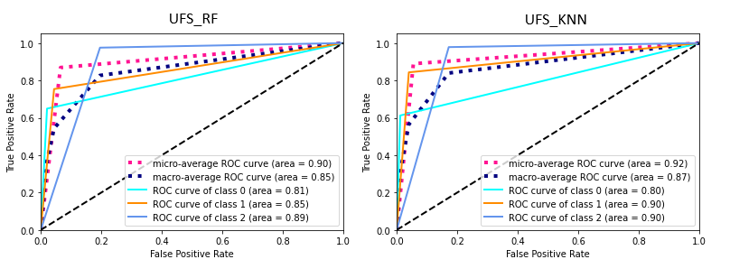

> <em> This study applies several supervised and semi-supervised learning techniques on the
dataset of diabetes in 130 hospitals in the USA for the years 1999 to 2008 to tackle two
classification problems with target feature of readmission rate and gender, respectively. The best
final supervised model successfully distinguishes three different types of readmission with 89%
average accuracy. Moreover, results show that even with a large portion (90%) of unlabelled
data, the best final semi-supervised learners reach 69% accuracy with >63 precision for all
classes. The result also suggests no significant difference between diabetes patients of different
gender in terms of their inpatient and medication records.</em>

## Introduction

According to data collected by WHO, diabetes is one of the top ten ranked causes of death
worldwide, and the number of diabetes patients has raised to 422 million in 2014. For some
patients, getting inpatient treatment is only a part of the uphill battle with hyperglycemia.
Studies have found that the proper management of patients in hospitals is critical to the
resulting morbidity and mortality. Patients who readmit within 30 days usually do not recover
better than the majority of patients who readmit after 30 days or those without readmission.
The task of predicting readmission rates could provide insights on how to manage patients more
safely. We hypothesize that the readmission rate could be effectively predicted by the clinical
records associate with that patient. Moreover, we hypothesize that there exists little correlation
between the genders of the patient and their clinical records.

## Data Exploration
  
### Data Structure Summary
The target dataset was extracted from clinical care records in 130 hospitals in the USA from
1999 to 2008. There are 101766 records extracted that fit the criteria forced by the original
study. Before conducting data exploration manually, it is worth noticing that Table 1 in the
[original study](https://www.hindawi.com/journals/bmri/2014/781670/) provides a decent summary of all features. According to the original research,
there are 11 numerical features and 39 nominal features in the dataset. Among those 40
nominal features, only 2 of them are binomial. Table 1 also reveals that there are missing data
for features Race, Weight, Payer code. Medical specialty and Diagnosis 3.
The next step is to explore the dataset and find potential features to be extracted or cleaned.
There is not much insight that can be gained from `Dataframe.info()` and `Dataframe.describe()`.
Thus, I utilize the [`Pandas Profiling`](https://github.com/pandas-profiling/pandas-profiling) package to generate a detailed summary of the original
dataset. The properties of all features can be inspected directly from the <Variables> section of
the iframe. By inspecting results, some interesting characteristics can be extracted for this
dataset. The majority of features are nominal and missing values are encoded by `?` instead of
`nan`. Some features are essentially useless to our goal, and some features need to be
appropriately engineered before usage. The following table demonstrates a detailed
exploration result I summarized for each feature.

#### Table 1: Data Exploration Summary

| **Feature name** | **Feature type** | **Feature properties** |
|:--------|:-------:|--------:|
| **encounter\_id** | Numerical | There are 101766 unique values for 101766 total instances. |
|----
| **patient\_nbr** | Numerical | There are some patients who visit the hospital multiple times. For example, 40 instances in the database have the same patient\_nbr. Clearly the readmission results from the same patient are not statically independent. |
|----
| **race** | Categorical | There are 2273 missing values encoded by &quot;?&quot; |
|----
| **gender** | Categorical | There are three missing values encoded by &quot;Unknown/Invalid&quot; |
|----
| **age** | Categorical | The majority of data are collected from 50 – 90 years old. |
|----
| **weight** | Categorical | There are 98569 missing values encoded by &quot;?&quot; |
|----
| **admission\_type\_id** | Categorical | There are nine unique values, and some are not available. |
|----
| **discharge\_disposition\_id** | Categorical | There are 29 unique values, and some are not available. |
|----
| **admission\_source\_id** | Categorical | There are 21 unique values |
|----
| **time\_in\_hospital** | Numerical | The majority is from 1-4 days |
|----
| **payer\_code** | Categorical | There are 23 unique values |
|----
| **medical\_specialty** | Categorical | High cardinality. 49949 values are missing encoded by &#39;?&#39; |
|----
| **num\_lab\_procedures** | Numerical | Nothing interesting |
|----
| **num\_procedures** | Numerical | The majority is 0 |
|----
| **num\_medications** | Numerical | Nothing interesting |
|----
| **number\_outpatient** | Numerical | The majority does not have outpatient visits preceding the encounter |
|----
| **number\_emergency** | Numerical | The majority does not have emergency visits preceding the encounter |
|----
| **number\_inpatient** | Numerical | The majority does not have inpatient visits preceding the encounter |
|----
| **diag\_1** | Categorical | High cardinality. Although it is not mentioned in the [original study](https://www.hindawi.com/journals/bmri/2014/781670/), there are 21 missing values encoded by &#39;?&#39;. |
|----
| **diag\_2** | Categorical | High cardinality. Although it is not mentioned in the [original study](https://www.hindawi.com/journals/bmri/2014/781670/), there are 358 missing values encoded by &#39;?&#39;. |
|----
| **diag\_3** | Categorical | High cardinality. There are 1423 missing values encoded by &#39;?&#39; |
|----
| **number\_diagnoses** | Numerical | The majority is 9 |
|----
| **max\_glu\_serum** | Ordinal | The majority is &#39;none&#39; |
|----
| **A1Cresult** | Ordinal | The majority is &#39;none&#39; |
|----
| **acetohexamide** | Ordinal | All records except one are &#39;No&#39; |
|----
| **examide** | Ordinal | All records are &#39;No&#39; |
|----
| **citoglipton** | Ordinal | All records are &#39;No&#39; |
|----
| **glimepiride-pioglitazone** | Ordinal | All records except 1 are &#39;No&#39; |
|----
| **metformin-rosiglitazone** | Ordinal | All records except 2 are &#39;No&#39; |
|----
| **metformin-pioglitazone** | Ordinal | All records except 1 are &#39;No&#39; |
|----
| **Other medication features** | Ordinal | The majority are &#39;No&#39; |
|----
| **change** | Ordinal | Nothing interesting |
|----
| **diabetesMed** | Ordinal | Nothing interesting |
|----
| **readmitted** | Ordinal | This is the target feature of the first task. This feature is imbalanced.
{: rules="groups"}

## Feature Engineering and Preprocessing
The first objective is to drop those invalid features and records. For features that contain minor
fractions of missing values (namely `race`, `gender`, `diag_1`, `diag_2`, and `diag_3`), only those records
which contain missing values need to be dropped.

The features `weight`, `payer_code`, and `medical_specialty` have a large portion of the data
missing; thus, any subjective approach to impute those missing values will have an effect on the
underlying model; therefore, those features are dropped from the dataset.

Moreover, the feature `encounter_id` and `patient_id` are presumably generated sequentially by
computers; thus, they are irrelevant to the target features for all tasks. Feature 'encounter_id' is
dropped while `patient_id` is kept temporarily to deal with the statistical independence
problem. To enforce the statistical independence between records, I choose to only keep the
first encounter for each patient if the patient has multiple encounters.
Additionally, I dropped features with a constant value or highly imbalanced values such as
`acetohexamide`, `examide`, and `citoglipton` since they have practically little effect on the
targets.

With all irrelevant records and features dropped, I move on to the process of feature
engineering. Generally, categorical features are encoded by `OneHotEncoder`, and ordinal
features are encoded by `OridinalEncoder` with different mapping schemes. Some special cases
are handled by more specific procedures. For example, feature `admission_source_id` is grouped
by similarity then encoded. Table 2 contains the detail of procedures I followed to clean each
feature and my rationales.

After feature engineering, if the target feature is imbalanced(e.g., readmitted), the dataset is
balanced using the `SMOTEENN` algorithm. I tried different resampling ratios discovered that the
default `not majority` setting performs the best; despite that it results in much fewer samples
with the label `No`. Finally, dataset and labels are splited to train and test sets in a ratio of 7 : 3.
A feature correlation graph is drawn on the balanced dataset. Upon inspection, no significant
correlation are found between target features and other features for both tasks.

### Table 2: Feature Engineering/Pre-processing Summary

| **Feature name** | **Engineering procedure** | **Rationale/Explanation** |
|:--------|:-------:|--------:|
| **encounter\_id** | Dropped from dataset | Irrelevant to targets |
|----
| **patient\_nbr** | Dropped from dataset | Irrelevant to targets |
|----
| **race** | Encode by OneHotEncoder | Categorical feature |
|----
| **gender** | Encode by OneHotEncoder | Categorical feature |
|----
| **age** | Encode by OneHotEncoder | Categorical feature |
|----
| **weight** | Dropped from dataset | Too many missing values |
|----
| **admission\_type\_id** | Grouping then encoded by OneHotEncoder | Upon consulting the IDs\_mapping.csv, I find that admission types 1,2, and 7 are similar and type 5,6, and 8 are similar. Thus, the grouping technique can be applied here to reduce dimension. Then this feature is encoded by OneHotEncoder. |
|----
| **discharge\_disposition\_id** | Grouping then encoded by OneHotEncoder | In the [original study](https://www.hindawi.com/journals/bmri/2014/781670/), the authors dropped all records where the patient is dead or discharged to hospice, then grouped every type other than &#39;Discharged to home&#39; into one. I take a similar approach, where I group those dispositions by severity and availability. For example, &#39;Discharged/transferred to home with home health service&#39; is grouped with &#39;Discharged to home&#39;, &#39;Expired at home. Medicaid only, hospice&#39; is grouped with &#39;Expired&#39;, etc. |
|----
| **admission\_source\_id** | Grouping then encoded by OneHotEncoder | The original paper only grouped admission\_source into 3 clusters. However, my grouping approach is more specific. Some clustering can be formed such as, &#39;admission by transfer&#39;, &#39;admission of newborn&#39;, etc. |
|----
| **time\_in\_hospital** | Normalize by MinMaxScaler | Numerical feature |
|----
| **payer\_code** | Dropped from dataset | Irrelevant to targets |
|----
| **medical\_specialty** | Dropped from dataset | Too many missing values |
|----
| **num\_lab\_procedures** | Normalize by MinMaxScaler | Numerical feature |
|----
| **num\_procedures** | Normalize by MinMaxScaler | Numerical feature |
|----
| **num\_medications** | Normalize by MinMaxScaler | Numerical feature |
|----
| **number\_outpatient** | Normalize by MinMaxScaler | Numerical feature |
|----
| **number\_emergency** | Normalize by MinMaxScaler | Numerical feature |
|----
| **number\_inpatient** | Normalize by MinMaxScaler | Numerical feature |
|----
| **diag\_1** | Grouping then encoded by OneHotEncoder | I group all the unique values according to Table 2 of the [original study](https://www.hindawi.com/journals/bmri/2014/781670/) |
|----
| **diag\_2** | Grouping then encoded by OneHotEncoder | I group all the unique values according to Table 2 of the [original study](https://www.hindawi.com/journals/bmri/2014/781670/) |
|----
| **diag\_3** | Grouping then encoded by OneHotEncoder | I group all the unique values according to Table 2 of the [original study](https://www.hindawi.com/journals/bmri/2014/781670/) |
|----
| **number\_diagnoses** | Normalize by MinMaxScaler | Numerical feature |
|----
| **max\_glu\_serum** | Encode by OrdinalEncoder | Ordinal feature ordered by the test result |
|----
| **A1Cresult** | Encode by OrdinalEncoder | Ordinal feature ordered by the test result |
|----
| **acetohexamide** | Dropped from dataset | Too Imbalanced values |
|----
| **examide** | Dropped from dataset | Constant |
|----
| **citoglipton** | Dropped from dataset | Constant |
|----
| **glimepiride-pioglitazone** | Dropped from dataset | Too Imbalanced values |
|----
| **metformin-rosiglitazone** | Dropped from dataset | Too Imbalanced values |
|----
| **metformin-pioglitazone** | Dropped from dataset | Too Imbalanced values |
|----
| **Other medication features** | Grouping then encode by OrdinalEncoder | Ordinal feature ordered by dose amount |
|----
| **change** | Encode by OrdinalEncoder. | Ordinal feature ordered by \&lt; positive class is 1\&gt; |
|----
| **diabetesMed** | Encode by OrdinalEncoder | Ordinal feature ordered by \&lt; positive class is 1\&gt; |
|----
| **readmitted** | Encode by OrdinalEncoder | Ordinal feature ordered by severity |
|----
{: rules="groups"}

## Methods
### Supervised learning with feature `readmitted` as target
This task aims to tackle a multi-class classification problem. The label feature 'readmitted' is
encoded with the order of 'No', '>30', and '<30'. The reason why I choose this order is to capture
how well the patient is recovered. A patient who is readmitted within 30 days is more likely to
be recovered worse than those who got readmitted after 30 days and no admission at all.

The following is how I configure each model:
- For SVM, I used SVC from Sci-kit Learn. The model uses the polynomial kernel since it performs
better than the linear kernel.
- For Decision Tree, I used DecisionTreeClassifier from Sci-kit Learn. The model uses a balanced
class weight.
- For Neuron Network, I used MLPClassifier from Sci-kit Learn. The model consists of 3 hidden
layers with 68 hidden units for each layer and uses ReLU as the activation function.
- For K-Nearest-Neighbor, I used KNeighborsClassifier from Sci-kit Learn with 5 neighbors, which is
found to be optimal by grid search.
- For Naïve Bayesian, I used the GaussianNB classifier from Sci-kit Learn with default parameters.
- For Random Forest, I used RandomForestClassifier from Sci-kit Learn. The model uses the Gini
function as the criterion.

Each model is trained and evaluated by 10-fold cross-validation on the dataset. I used k-fold
validation because it can utilize the whole dataset and mitigate the effect caused by randomly
splitting test and train data. For each fold, I record the accuracy, training time, and validation
time. After the ten folds, I computed the average training accuracy, average training time, and
average validation time. Then I also computed the average precision, recall, f1 score for each
class, as well as the weighted average. Finally, a ROC curve graph is drawn based on crossvalidated estimates for each input data point.

To determine the statistical significance, I used the paired t-test to deal with multiple algorithms
and one dataset.

Lastly, I performed univariate feature selection to select only 50 best features (Original is 75
after feature engineering) and retrained two best models on the new dataset.

### Supervised learning with feature `gender` as target
This task aims to tackle a binary classification problem with the feature 'gender' as the target
label. The labels are quite balanced for this task, so I did not perform resampling. I used the
same set of models with similar parameters. Like in the previous section, I used 10-fold cross-validation and
the same metrics, including average f1-score for each class, accuracy, training time, validation
time, and ROC curve. Again, the paired t-test is used to determine the statistical significance
between models. Univariate Feature Selection is also applied in this task to test the effect of
reducing data dimensionality on average accuracy.

### Semi-supervised learning
The goal of this task is the same as first task but achieved by using semi-supervised learning
algorithms. The dataset I used is the same used in Supervised learning tasks. The three
algorithms I chose are Label Propagation, Label Spreading, and Self-training.
The following is how I configure each model:
- For Label Propagation, I used the KNN kernel with a 10000 maximum iteration limit. I attempted
to use RBF kernel but ran into memory issues frequently on both Google Colab and my PC. For
label spreading, I used the same set of parameters as Label Propagation. The same memory
issue occurred too for the RBF kernel.
- For Self-training, I used Random Forest as the base learner and batch pseudo-labels. The
algorithm stops when there are no pseudo-labels with 99% predictive confidence. 

All models are trained and tested on 6 levels(0%, 10%, 20%, 50%, 90%, and 95%) of unlabelled
data. I used similar evaluation metrics as in the first task, including average f1-score for each class,
accuracy, training time, and ROC curve.
To determine the statistical significance, I used both Wilcoxon's Signed Rank Test and
Friedman's Test as we are dealing with multiple algorithms on multiple datasets.

## Results and Discussion
### Supervised learning with feature `readmitted` as target

#### Table 3: Supervised Model Results for Readmission rate as target

| **Model** | **Average accuracy** | **Macro-avg ROC curve** | **Average f1-score (No)** | **Average f1-score (>30)** | **Average f1-score (<30)** | **Average Training time** | **Average Validating time** |
| --- | --- | --- | --- | --- | --- | --- | --- |
| **SVM** | 0.74 | 0.7 | 0.6 | 0.52 | 0.83 | 427.69 | 21 |
|----
| **Decision Tree** | 0.72 | 0.74 | 0.62 | 0.56 | 0.81 | 1.45 | 0.007 |
|----
| **Neuron Network** | 0.87 | 0.82 | 0.73 | 0.81 | 0.93 | 273.07 | 0.05 |
|----
| **KNN** | 0.89 | 0.87 | 0.76 | 0.86 | 0.93 | 1.6 | 65.1 |
|----
| **Naïve Bayesian** | 0.52 | 0.58 | 0.37 | 0.39 | 0.62 | 0.07 | 0.01 |
|----
| **Random Forest** | 0.88 | 0.85 | 0.78 | 0.82 | 0.93 | 12.50 | 0.21 |
{: rules="groups"}

Generally, the precision score is greater than the recall score for both class `>30` and `No` for all
algorithms, and the opposite is true for class `<30` for all models. Overall, the precision and
recall for class `<30` are higher than the other two classes, which meet the expectation as it is
the focus class. As Table 3 demonstrates, KNN, Neuron Network, and Random Forest are the top
three best models on this dataset. The best model, KNN with five neighbors, gives a result of
0.89 average accuracy and 0.89 weighted average f1-score across three classes. Neuron
Network and Random Forest perform similarly, and both are slightly worse than KNN. In fact,
Paired t-tests prove that there is no significant difference between Neuron Network and
Random Forest. However, Random Forest trains much faster than Neuron Network; thus, it is
the preferred one. SVM and Decision Tree have similar average accuracy but decision tree trains
much faster than SVM, and the average ROC curve cover more area than SVM. Gaussian Naïve
Bayesian model has the worst results in terms of accuracy and f1-score, which indicates that this
dataset might not follow the Gaussian distribution.

The Paired t-test indicates that there exist significant differences between each pair of models
except Neuron Network and Random Forest. 

After running the best two best models on the new
dataset obtained from univariate feature selection, I found that the accuracies do not decrease
much, while the training processes for KNN is a lot faster than before.

### Supervised learning with feature `gender` as target

#### Table 6: Supervised Model Results for Gender as target

| **Model** | **Average accuracy** | **Macro-avg ROC curve** | **Average f1-score &#39;Female&#39;** | **Average f1-score &#39;Male&#39;** | **Average Training time** | **Average Validating time** |
| --- | --- | --- | --- | --- | --- | --- |
| **SVM** | 0.58 | 0.57 | 0.64 | 0.49 | 621.45 | 23.06 |
|----
| **Decision Tree** | 0.53 | 0.52 | 0.56 | 0.49 | 0.88 | 0.008 |
|----
| **Neuron Network** | 0.54 | 0.55 | 0.57 | 0.51 | 300.99 | 0.02 |
|----
| **KNN** | 0.54 | 0.53 | 0.58 | 0.49 | 1.75 | 43.96 |
|----
| **Naïve Bayesian** | 0.57 | 0.55 | 0.63 | 0.47 | 0.05 | 0.009 |
|----
| **Random Forest** | 0.57 | 0.56 | 0.62 | 0.50 | 14.62 | 0.31 |
{: rules="groups"}

Table 6 records a summary of performance for all models. Generally, all six models give similar
accuracy, which is ranged from 53% to 58%. Paired t-test finds that there exist significant
differences between all pair of models except NN vs KNN and Naïve Bayesian vs Random Forest.
The training time pattern is similar to the results in previous section. The result of this task indicates
that it is difficult to distinguish gender by the combination of features in this dataset. I suspect
we would probably get higher accuracy predicting gender by using the patient's name solely. By
reducing the feature space to only 10 (Original is 55 after pre-processing), the average accuracy
of prediction only decreased by 1% for both Random Forest and K-Nearest Neighbor. This
discovery further proves that label gender is indistinguishable for this dataset.

### Semi-supervised learning

Table 7: Section 5.3 Model Results

| **Model** | **Baseline (0%) Average Accuracy** | **10% Average Accuracy** | **20% Average Accuracy** | **50% Average Accuracy** | **90% Average Accuracy** | **95% Average Accuracy** | **Average Training time** |
| --- | --- | --- | --- | --- | --- | --- | --- |
| **Label Propagation** | 0.81 | 0.80 | 0.79 | 0.70 (did not converge) | 0.20 (did not converge) | 0.16 (did not converge) | 370.21 |
|----
| **Label Spreading** | 0.80 | 0.79 | 0.78 | 0.76 | 0.59 | 0.48 | 359.78 |
|----
| **Self-Training** | 0.86 | 0.85 | 0.84 | 0.80 | 0.69 | 0.65 | N/A
{: rules="groups"}

Generally, the accuracy decreases as the percent of unlabelled data increases. As demonstrated
in Table 7, Random Forest based Self-training performs the best in all scenarios. Label
Propagation takes a long time to converge. When there are more than 50% of data are
unlabelled, Label Propagation does not converge even after 10000 iterations. Thus, its accuracy
falls off when the percentage exceeds 50%. This result suggests that Label Spreading is more
robust to noise than Label Propagation. 

Not surprisingly, Friedman's Test finds that all 
algorithms do not perform equally on those 6 data sets. Wilcoxon's Signed Rank Test and
Nemenyi Diagram indicate that there are statistically significant differences between Label
Spreading and Self-training, and Label Propagation and Self-training. For the baseline scenario
(0% unlabelled), semi-supervised learning results are not better than supervised learning on this
dataset. Overall there is no improvement in learning accuracy when a large amount of data is
unlabelled. The under-performance suggests that this dataset might violate the assumption of
semi-supervised learning.

## Conclusion and Future Work
In conclusion, although the original dataset is noisy and redundant, after proper data cleaning
and feature engineering, supervised learning algorithms such as K-Nearest Neighbor and
Random Forest are proven to be useful for predicting the readmission rates of this dataset. The
best model achieves 89% average accuracy with only 1.6 seconds average training time. Most
importantly, the average f1-score of the focus class' readmission less than 30 days' reaches 93%,
while the average f1 score of the other two categories is still larger than 75%. Semi-supervised
learning algorithms do not perform better on this dataset than supervised methods. Still, it
provides a baseline to the performance of a real-world scenario where most of the dataset
could be unlabelled. For the gender classification task, the low accuracy indicates that it is
difficult to distinguish a diabetes patient's gender, which meets our expectations. Thus diabetes
patients of all genders should be treated indifferently. Moreover, the low accuracy of gender
prediction task proves the “Garbage in, Garbage out” principle in machine learning.

There are many possible extensions to the current work. For the supervised readmission rate
classification task, it is interesting to explore how boosting can improve weak learners(i.e., Naïve
Bayesian model) for this dataset. Additionally, we could try some more feature selection
techniques such as recursive feature elimination and SelectFromModel. For the semi-supervised
task, the convergence issue and memory issue caused by the RBF kernel should be considered.
Current work could also be extended by implementing co-training methods like multi-view colearning.
